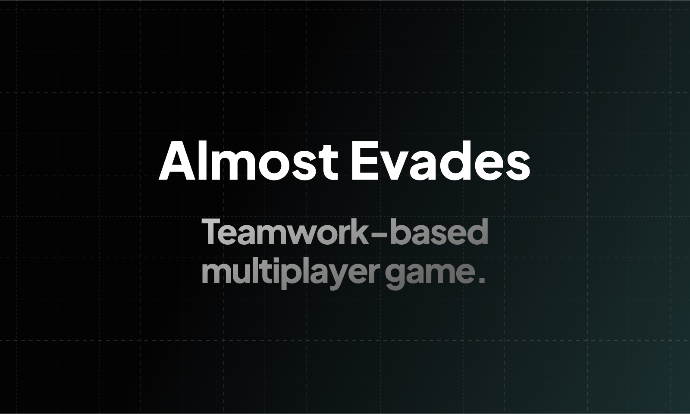

# 🔴 Almost Evades

> Teamwork-based multiplayer game.


## 🧰 Tech Stack

- [Appwrite](https://appwrite.io/)
- [Tailwind CSS](https://tailwindcss.com/)
- [Svelte Kit](https://kit.svelte.dev/)
- [Kaboom](https://kaboomjs.com/)
- [Colyseus](https://www.colyseus.io/)

## 🛠️ Setup Server

1. Setup Appwrite server
2. Create project `almostEvades`
3. Install Appwrite CLI
4. Login with `appwrite login`
5. Enter `cd backend`
6. Deploy database structure with `appwrite deploy collection`
7. Deploy functions with `appwrite deploy function`
8. Set variables on deployed functions. There is `backend/functions` folder for each function. They all have `README.md` describing what variables they need

## 🌐 Setup Colyseus Server

1. Enter `cd backend/colyseus-server`
2. Install dependencies `npm install`
3. Create .env `cp .env.example .env`
4. Edit .env `nano .env`
5. Start server `npm start`

## 👀 Setup Client

1. Install libarries `npm install`
2. Update `appwriteEndpoint` in `src/lib/appwrite.ts` (Appwrite endpoint from server setup)
3. Start server `npm run dev`

## 🚀 Deploy Client

1. Deploy frontend and backend on the same domain. For example, `myapp.com` and `appwrite.myapp.com`
2. Add frontend hostname as a platform in Appwrite project

## 🛎️ Deploy Colyseus Server

Run following commands to setup an instance of Colyseus server:

```sh
# Machine setup
curl -fsSL https://deb.nodesource.com/setup_19.x | bash - && apt-get install -y nodejs

# SSL setup
sudo snap install core; sudo snap refresh core
sudo snap set certbot trust-plugin-with-root=ok
sudo snap install --classic certbot
sudo ln -s /snap/bin/certbot /usr/bin/certbot

sudo apt install -y nginx

nano /etc/nginx/sites-available/eu1.evades.almostapps.eu

# Code to put into:
# server {
#     listen 80;
#     listen [::]:80;
#     server_name eu1.evades.almostapps.eu;

#     location / {
#         proxy_pass http://127.0.0.1:3000;
#         proxy_set_header Host $host;
#         proxy_set_header X-Forwarded-Proto $scheme;
#         proxy_set_header X-Real-IP $remote_addr;
#         proxy_set_header X-Forwarded-For $proxy_add_x_forwarded_for;
#     }
# }

ln -s /etc/nginx/sites-available/eu1.evades.almostapps.eu /etc/nginx/sites-enabled/eu1.evades.almostapps.eu
sudo service nginx reload
sudo snap install certbot-dns-google

certbot

sudo service nginx reload

# Project setup
git clone https://github.com/Meldiron/almost-evades.git
cd almost-evades/backend/colyseus-server
npm install

# Production setup
cp .env.example .env
nano .env # (api_key)
npm run build

# Server start
screen -S colyseus
node lib/index.js
```

## 🤝 Contributing

When contributing to backend-related logic, make sure to sync-up `backend/appwrite.json` by running the `appwrite init` commands in the `backend` folder.

## 🖼️ Screenshots


## 🏗️ TODOs

- circle with circle collision
- more maps
- upgrades
- abilities
- claim anonymous account

## 🤖 Svelte Kit Generated Documentation

Everything you need to build a Svelte project, powered by [`create-svelte`](https://github.com/sveltejs/kit/tree/master/packages/create-svelte).

## Creating a project

If you're seeing this, you've probably already done this step. Congrats!

```bash
# create a new project in the current directory
npm create svelte@latest

# create a new project in my-app
npm create svelte@latest my-app
```

## Developing

Once you've created a project and installed dependencies with `npm install` (or `pnpm install` or `yarn`), start a development server:

```bash
npm run dev

# or start the server and open the app in a new browser tab
npm run dev -- --open
```

## Building

To create a production version of your app:

```bash
npm run build
```

You can preview the production build with `npm run preview`.

> To deploy your app, you may need to install an [adapter](https://kit.svelte.dev/docs/adapters) for your target environment.
